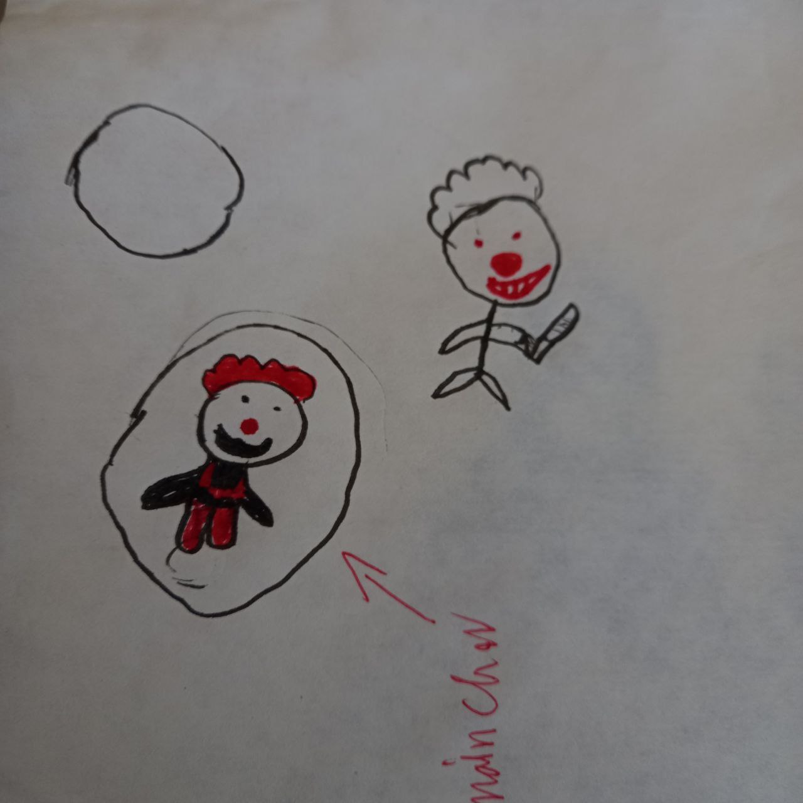

# Clown Game

A fun, action-packed game where you control a clown and avoid toy and killer clown . Built with **Pygame**.

## Character Design:
Designed by my student **Kian**, and made digital by me!

  

## Features:
- Control the player using the left/right arrow keys.
- Avoid enemies falling from the top of the screen.
- Score increases as you dodge enemies; game ends on collision.

## Requirements:
- Python 3.x
- Pygame 

## Credits:
- **Character Design**: Kian

